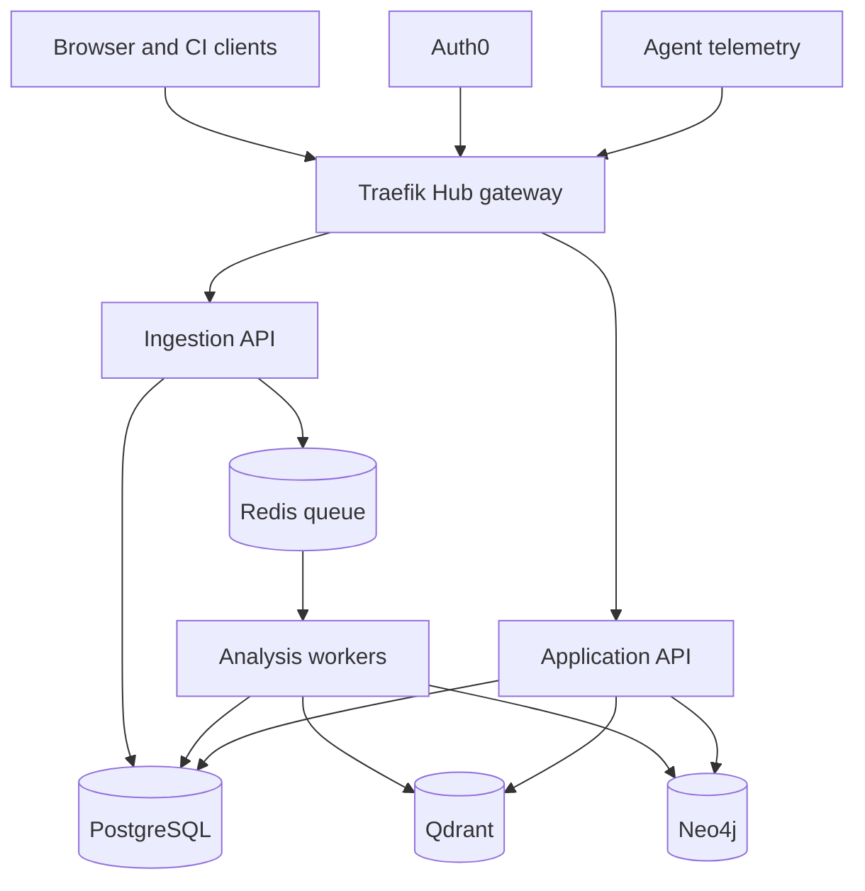

# AgentProof

AgentProof helps teams inspect AI agent runs, verify behavior against policies and expected workflows, and gate releases with evidence-backed evaluations.

> **Status: architecture and implementation plan.** This README documents the intended product and technical design. The supplied material does not include an application repository, working deployment, public endpoints, maintainers' contact details, or released software. Commands and APIs described as proposed below are contracts to implement, not currently verified interfaces.

## Status and ownership

| Field | Current state |
|---|---|
| Maturity | Design / pre-implementation |
| Ownership | Not specified in the project materials |
| Contact and on-call | Not established; required before operating a shared service |
| Source of record and issue tracker | Not supplied |

## Contents

- [Overview](#overview)
- [Architecture](#architecture)
- [Getting started](#getting-started)
- [Configuration](#configuration)
- [Usage](#usage)
- [Development](#development)
- [Testing](#testing)
- [Build and deployment](#build-and-deployment)
- [Observability](#observability)
- [Security](#security)
- [Compliance and data handling](#compliance-and-data-handling)
- [Service levels and support](#service-levels-and-support)
- [Versioning and compatibility](#versioning-and-compatibility)
- [Governance](#governance)
- [Roadmap](#roadmap)
- [Contributing](#contributing)

## Overview

An agent may complete a task while skipping an approval, making an unnecessary sensitive-data request, repeating retrievals, or acting on unsupported evidence. Output-only evaluation misses these execution failures. AgentProof examines the full trajectory and links each confirmed finding to trace spans, policy versions, workflow requirements, or reproducible measurements.

It accepts OpenTelemetry-compatible agent traces, normalizes framework-specific events, runs structured checks, retrieves bounded contextual evidence for semantic critics, and presents the result in an investigation UI. The same evaluation results can inform a CI regression gate. Outcome success and behavioral correctness remain separate statuses.

### Capabilities

- Inspect traces, tool calls, retrievals, handoffs, approvals, findings, and their supporting evidence.
- Detect invalid arguments, wrong tools, loops, missing steps, policy violations, unsupported conclusions, and cost regressions.
- Compare expected and actual trajectories, identify possible causes, and record reviewer decisions.
- Compare agent versions on versioned datasets and return `PASS`, `FAIL`, or `ERROR` to an existing CI pipeline.

### Non-goals

- Hosting or executing arbitrary customer agent code in the initial release; evaluation cases run in the customer's own CI environment.
- Replacing general-purpose telemetry storage, CI services, or human review of ambiguous findings.
- Automatically rewriting prompts or agent code, or guaranteeing formal proof of unrestricted natural-language behavior.
- Fine-tuning LLMs as part of this design.

## Architecture



PostgreSQL is authoritative for canonical business data. Qdrant indexes semantic representations; Neo4j projects trajectory and evidence relationships. Both projections must be rebuildable from versioned records in PostgreSQL. Redis coordinates asynchronous work. The API and ingestion entrypoints share one domain package but can scale independently.

### Components

| Component | Responsibility | Planned location |
|---|---|---|
| Web | Trace Explorer, evidence graph, evaluation comparison | `apps/web/` |
| Application API | Project authorization, commands, queries, reviews, gate results | `apps/api/` |
| Ingestion API | Authenticate, validate, redact, normalize, persist, enqueue | `apps/ingestion/` |
| Workers | Rules, statistics, retrieval, critics, evidence validation, RCA, evaluation | `apps/worker/`, `src/agentproof/` |
| Domain core | Canonical trace, policy, finding, evaluation models and ports | `src/agentproof/core/` |
| Infrastructure adapters | PostgreSQL, Qdrant, Neo4j, Redis, Auth0, LLM, telemetry | `src/agentproof/infrastructure/` |

The canonical hierarchy includes agent, LLM, tool, retrieval, handoff, guardrail, and approval spans. Framework adapters map source traces to this model. `core/` depends on interfaces rather than SQLAlchemy, vendor SDKs, or LangGraph.

### Analysis and evidence

1. Ingestion persists a normalized trace and a durable analysis-job record in PostgreSQL, then arranges delivery to workers. The queue message identifies the job; it is not the trace database. The enqueue boundary needs a transactional outbox or equivalent recovery sweep so an accepted trace cannot be silently stranded between database commit and queue publication.
2. Deterministic checks validate tool arguments, ordering, approvals, explicit policy conditions, and repeated actions. Statistical detectors compare latency, token use, cost, and baseline distributions.
3. Candidate findings retrieve policy clauses, specifications, similar incidents, and evidence summaries from Qdrant with project and version filters. Neo4j supports path and relationship queries. Source identifiers refer back to authoritative, versioned records.
4. LangGraph coordinates focused trajectory, policy, and efficiency critics only where semantic judgment helps. Each critic receives a bounded, redacted evidence package and returns a structured judgment with evidence IDs and uncertainty.
5. An independent evidence validator checks referenced spans, source versions, graph relationships, values, and reproducible metrics. Unsupported judgments remain unconfirmed. RCA synthesis uses validated findings and labels observations, deterministic conclusions, semantic judgments, and hypotheses separately.

Analysis retries must be idempotent. A missing index or graph projection should surface as an unavailable capability or evaluation `ERROR`, not a fabricated clean result.

### External dependencies

| Dependency | Purpose | Planned failure behavior |
|---|---|---|
| Auth0 | Human OIDC and machine-to-machine credentials | Protected operations unavailable if authentication cannot complete |
| Traefik Hub API Gateway | Edge routing and coarse JWT/scope checks | Public API entry unavailable |
| PostgreSQL | Authoritative traces, metadata, policies, findings, evaluations | Ingestion and core application unavailable |
| Redis | Analysis and evaluation jobs, retries | New analysis delayed; persisted traces remain recoverable |
| Qdrant | Filtered semantic search | Semantic review degraded or evaluation marked `ERROR`, according to gate policy |
| Neo4j | Trajectory and evidence graph projection | Graph reasoning degraded or evaluation marked `ERROR`, according to gate policy |
| LLM provider | Semantic critics and RCA | Deterministic findings remain available; required semantic gates return `ERROR` |

## Getting started

There is currently no implementation repository or verified bootstrap command in the supplied materials. The first implementation milestone should add a pinned development toolchain, `docker-compose.yml`, `.env.example`, migration scripts, and a tested startup command. The intended local stack is Traefik, web, API, ingestion, worker, PostgreSQL, Redis, Qdrant, Neo4j, and an OpenTelemetry Collector.

A complete setup guide must then specify exact Docker/Compose, Python, and Node versions; Auth0 local configuration or a documented development identity option; secrets injection; database migration; seed data; demo trace import; and a verification request to `/health/ready`. Do not interpret the proposed endpoints in this README as evidence that those commands already work.

## Configuration

The following are **proposed configuration categories**, not implemented environment variables. Publish an exhaustive `.env.example` and secret-handling guide when the services exist.

| Setting category | Example name | Secret | Purpose |
|---|---|---|---|
| Database | `DATABASE_URL` | Yes | PostgreSQL connection |
| Work queue | `REDIS_URL` | Yes | Redis connection and job delivery |
| Vector index | `QDRANT_URL`, `QDRANT_API_KEY` | API key: yes | Qdrant access |
| Graph projection | `NEO4J_URI`, `NEO4J_PASSWORD` | Password: yes | Neo4j access |
| Identity | `AUTH0_ISSUER`, `AUTH0_AUDIENCE` | No | Token issuer and audience checks |
| Semantic critics | `LLM_API_KEY`, `LLM_MODEL` | API key: yes | Model access and reproducible model selection |
| Data handling | `TRACE_RETENTION_DAYS`, `REDACTION_POLICY` | Depends on policy | Retention and pre-persistence redaction |

Secrets belong in a secret store or local untracked environment file, never in committed configuration or trace payloads. The deployment must define precedence, validation, rotation, and failure behavior before launch.

## Usage

### Investigate an agent run

1. Instrument a demo customer-support agent to export OTLP spans and identify its project and agent version.
2. Open the trace to inspect the chronological trajectory, tool arguments after redaction, and expected workflow.
3. Follow a finding's evidence IDs to the original span, policy clause, approval requirement, and validator result.
4. Record a reviewer decision without changing the observed trace.

For example, a trace that calls `refund_order(amount=800)` without `request_approval` may show `Outcome: SUCCESS` and `Behavior: FAILED`, supported by the tool span and the applicable version of the refund policy. A missing required step is established from the complete relevant trajectory and its expected-path rule, with trace completeness recorded explicitly.

### Use AgentProof in an agent's CI

The customer CI runs its own agent against a versioned evaluation dataset, submits traces, waits for analysis, and queries a gate. This interface is **proposed**, including route names and CLI commands:

```text
Agent pull request -> run cases -> upload traces -> finalize evaluation
                   -> wait for completion -> compare baseline -> gate result
                   -> PASS: continue | FAIL: block | ERROR: investigate
```

Suggested API contract: `POST /api/v1/evaluations`, trace ingestion associated with the evaluation run, `POST /api/v1/evaluations/{id}/finalize`, and `GET /api/v1/evaluations/{id}/gate`. The client must time out safely, avoid treating pending or `ERROR` as `PASS`, and include dataset, agent version, policy version, evaluator configuration, and baseline identifiers in the result.

## Development

### Layout

```text
agentproof/
├── apps/               api, ingestion, worker, web entrypoints
├── src/agentproof/     core, auth, ingestion, analysis, critics, knowledge,
│                     evaluation, infrastructure
├── deploy/             Compose and Helm deployment definitions
├── examples/           customer-support agent and evaluation cases
├── tests/              unit, contract, integration, end-to-end
├── docs/               API, runbooks, architecture decisions
└── scripts/            local development and migration helpers
```

The planned stack is Next.js and TypeScript with React Flow; FastAPI, Pydantic, SQLAlchemy 2 and Alembic; PostgreSQL, Qdrant, Neo4j and Redis; LangGraph for semantic-critic orchestration; OpenTelemetry; Docker Compose locally and Kubernetes with Helm for a later deployment. Separate entrypoints do not require separate domain codebases.

### Standards and local loop

Use Ruff and type checking for Python, ESLint and TypeScript checks for the web app, pytest for backend tests, and Playwright for browser flows. Define commit, review, and branching rules in the repository once it exists. A normal change should pass formatting and type checks, relevant unit tests, integration tests for affected adapters, and a local review of the reference trace.

## Testing

| Tier | Required checks | Intended environment |
|---|---|---|
| Unit | Policy predicates, argument validation, trajectory alignment, metrics, evidence references, gate logic | Pull request CI |
| Contract | OTLP mapping, adapter normalization, stable API/event schemas | Pull request CI |
| Integration | Ingest → persist → enqueue → worker; PostgreSQL/Qdrant/Neo4j projections; migration upgrade | Pull request CI with isolated services |
| End to end | Valid refund, omitted approval, wrong tool, invalid amount, retrieval loop, controlled retry, gate outcomes | Staging or test deployment |

Each fixture needs expected finding types and evidence IDs. Test duplicate delivery, worker crashes, missing projections, partial traces, and fail-closed behavior for mandatory gates. A coverage threshold is not specified yet; set one only after the repository and meaningful tests exist.

## Build and deployment

### AgentProof's own CI/CD

| Stage | Proposed check or action | Promotion condition |
|---|---|---|
| Pull request | Ruff, type checks, pytest, migration checks, frontend lint/build, relevant Playwright tests | Required checks pass |
| Merge to main | Build web, API, ingestion, and worker images tagged by commit SHA | Images published to a registry |
| Staging | Apply compatible migration once, deploy with Helm, run health and end-to-end smoke tests | Healthy and tested release |
| Production | Promote the same image digests using a controlled release | Explicit release approval in the eventual operating policy |

Use a single migration job before application rollout rather than running Alembic concurrently in every API pod. Database changes should be compatible with both old and new application versions across a rolling update. If migration fails, halt rollout. Rollback should restore previous image digests; it must not assume that reversing an arbitrary database migration is safe. A production rollback command and recovery target cannot be verified until the release name, cluster, and deployment process exist.

### Agent customers' CI/CD

AgentProof provides a quality gate inside an existing CI system. The customer executes agent cases in its own environment and sends traces. A gate evaluates the candidate against an explicitly identified baseline and dataset. For example, higher task success must not offset a breached mandatory policy-violation threshold. `FAIL` represents a completed evaluation that violates a configured rule; `ERROR` represents an incomplete or untrustworthy evaluation, including unavailable required analysis.

CI authenticates with a narrowly scoped machine identity, such as `traces:ingest`, `evaluations:run`, and `evaluations:read`, rather than an interactive user account. A future CLI can map `PASS` to exit code 0 and `FAIL`/`ERROR` to distinct nonzero codes. The CLI and its commands have not been implemented in the supplied materials.

### Environments

Local development is planned with Docker Compose. Staging and production are proposed as Kubernetes/Helm environments; URLs, registry, cluster, approval owner, and rollout timing have not been assigned.

## Observability

Separate **customer agent traces being analyzed** from **AgentProof's own operational telemetry**. Customer OTLP data enters ingestion. Traefik, APIs, workers, queues, datastore adapters, and LLM calls emit their own logs, metrics, and traces to an operational observability backend.

Track ingestion acceptance and errors, durable-job backlog and age, worker retries, analysis stage latency, index lag, evidence-validator rejection rate, LLM failures, evaluation completeness, and gate results. Planned endpoints are `/health/live` and `/health/ready`; readiness should test only dependencies needed to serve that entrypoint. Dashboard, alert, and runbook locations remain to be established.

## Security

Auth0 is the proposed identity provider. Browser users use OIDC Authorization Code with PKCE; collectors and CI clients use client credentials. Traefik Hub handles edge routing and token/scope checks, while FastAPI checks project membership and ownership of each requested trace or evaluation. A scope such as `traces:read` alone never grants access across projects.

Redact credentials and configured sensitive fields before persistence, enforce limits on payload size and access to raw payloads, and audit privileged reads. Limit critic inputs to bounded, filtered evidence and treat retrieved text as untrusted data. Keep PostgreSQL, Redis, Qdrant, and Neo4j on private networks. TLS termination, encryption at rest, dependency scanning, secret rotation, and vulnerability reporting procedures need implementation and operational review before any real customer data is ingested.

## Compliance and data handling

Agent traces may contain personal data in messages, tool inputs, outputs, or retrieved documents. The design requires project-scoped access, field-level redaction, configurable retention, deletion across PostgreSQL and derived indexes, and auditable raw-payload access. Source and projection deletion must be coordinated so erased records cannot reappear after an index rebuild.

No jurisdictional regime, lawful basis, storage region, processor list, retention duration, or data-protection assessment is established in the provided material. These must be decided for the actual deployment and data before claiming compliance.

## Service levels and support

No production SLO, support hours, on-call rota, or incident channel has been established. The draft specification suggests engineering targets of p95 under 500 ms for ingestion acknowledgement, p95 under 2 seconds for deterministic analysis of a normal trace, and p95 under 2 seconds for the Trace Explorer initial load. These are **unvalidated targets**, not measured guarantees; benchmark the implementation and define alerting and error budgets before production operation.

## Versioning and compatibility

Version public APIs, canonical trace schemas, framework adapters, policies, expected workflows, datasets, evaluator configuration, and gate definitions. A historical finding or gate result should retain its code revision, agent version, complete input/dataset identifier, policy and workflow versions, model identifier, retrieval/index snapshot or source version, analysis configuration, and evidence references.

No release line or support window exists yet. Choose an API compatibility and deprecation policy before the first published integration. Do not suggest that replay is byte-for-byte reproducible when external LLMs or mutable data sources cannot be pinned.

### Artifact lineage

| Layer | Planned identifier | Purpose |
|---|---|---|
| Code and config | Commit SHA, image digest, configuration revision | Identify the running procedure |
| Inputs | Trace IDs, dataset and source-document versions | Identify the evaluated evidence |
| Analysis | Detector, policy, prompt, model, and gate versions | Explain how findings and decisions were produced |
| Results | Evaluation-run ID, finding IDs, evidence IDs | Inspect and compare outcomes |

## Governance

Architectural decisions that change the authoritative store, security boundary, canonical trace model, or gate semantics should be recorded as ADRs under `docs/adr/` once the repository exists. Project ownership, code review rules, release approval, and incident escalation are open operational decisions; no specific maintainer or approval count is implied here.

## Roadmap

| Phase | Deliverable | Status |
|---|---|---|
| 1. Trace foundation | Canonical model, OTLP ingestion, PostgreSQL, rules, basic explorer | Planned |
| 2. Behavioral forensics | Qdrant and Neo4j projections, critics, validator, RCA, evidence UI | Planned |
| 3. Release assurance | Versioned datasets, baseline comparison, gate API and CI integration | Planned |
| 4. Production hardening | Additional adapters, tenant isolation, operations, scale testing | Planned |

The first complete demonstration is a customer-support refund that succeeds at the task while violating an approval policy. The interface must reveal the missing approval, the exact tool call and applicable policy version, and a gate that rejects the regressed agent version.

## Contributing

Implementation contributions should preserve the authoritative-data boundary, keep domain logic independent of infrastructure SDKs, add evidence-backed tests for new failure classes, and document API or policy changes. Repository-specific instructions and contribution procedures should be added when the source repository is created.

## License

No license has been selected in the supplied project materials. Distribution terms should be documented before publishing the repository.
