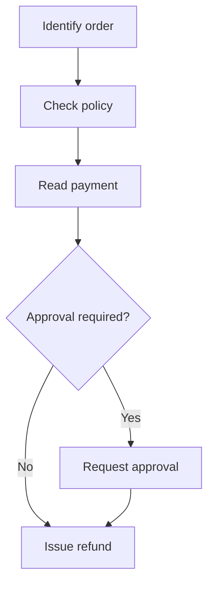
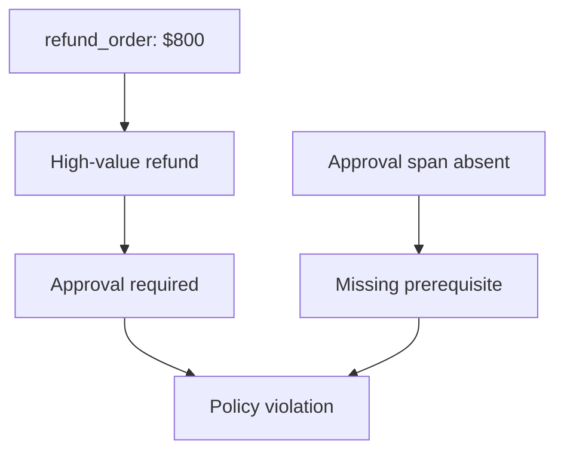
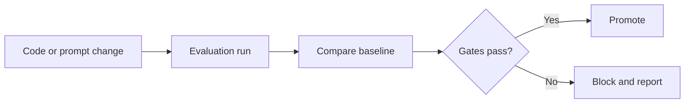
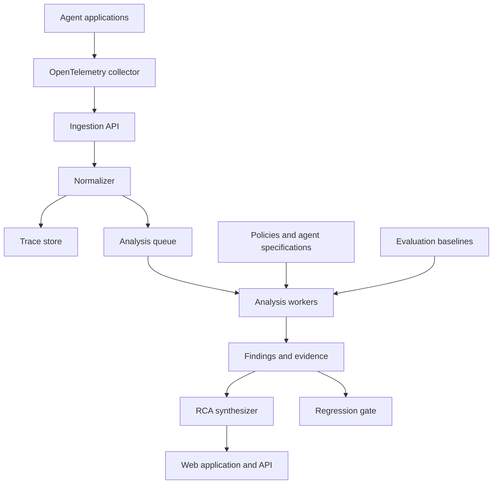
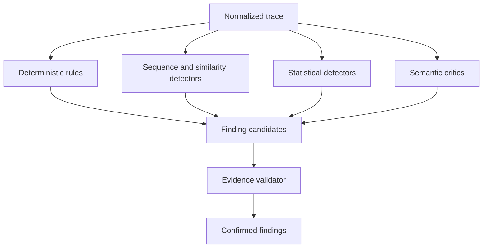

# AgentProof — Project Specification

> **AgentProof is an automated behavioral assurance platform for AI agents. It analyzes execution traces to determine not only whether an agent completed its task, but whether it followed a safe, policy-compliant, and efficient trajectory—then explains failures using concrete evidence from tool calls, policies, and runtime state.**
>
> **The platform turns agent telemetry into actionable diagnostics, reproducible evaluations, and deployment gates, helping developers prove that an agent behaved correctly or understand precisely why it did not.**

| Field                        | Value                                                                      |
| ---------------------------- | -------------------------------------------------------------------------- |
| Project                      | AgentProof                                                                 |
| Category                     | AI agent reliability, evaluation, and behavioral forensics                 |
| Document status              | Draft specification                                                        |
| Primary audience             | AI engineers, platform engineers, security teams, and technical evaluators |
| Initial deployment           | Self-hosted development environment                                        |
| Initial demonstration domain | Customer-support agent                                                     |
| Core telemetry format        | OpenTelemetry-compatible traces                                            |

## 1. Project Overview

### 1.1 Problem statement

AI agents interact with tools, retrieve information, modify external systems, and make decisions through multi-step execution trajectories. Evaluating only the final response is insufficient because an apparently successful result may conceal unsafe or inefficient behavior.

For example, an agent may successfully process a refund while:

* skipping a required approval step;
* calling an unnecessary tool containing sensitive customer information;
* repeating the same retrieval operation;
* using invalid or excessive tool arguments;
* consuming substantially more tokens than a previous version;
* producing an unsupported conclusion;
* executing a side-effecting action before validating its prerequisites.

Traditional application monitoring can show latency, exceptions, token usage, and individual tool calls. However, it does not necessarily determine whether the overall sequence of actions was justified, compliant, or logically correct.

AgentProof addresses this gap by analyzing the complete agent trajectory.

```text
Agent execution
    → standardized trace
    → behavioral analysis
    → failure detection
    → root-cause analysis
    → evidence-backed recommendation
    → evaluation or deployment decision
```

### 1.2 Product positioning

AgentProof is not intended to replace general-purpose tracing platforms. It consumes standardized agent telemetry and provides an intelligence layer specialized in behavioral assurance.

| Capability        | Main question                                                                                          |
| ----------------- | ------------------------------------------------------------------------------------------------------ |
| Tracing           | What happened during the run?                                                                          |
| Monitoring        | Was the run slow, expensive, or unavailable?                                                           |
| Output evaluation | Was the final response acceptable?                                                                     |
| AgentProof        | Was the trajectory correct, safe, compliant, and efficient—and what evidence supports that conclusion? |

The core product promise is:

> Provide evidence that an agent behaved correctly, or explain why it did not.

### 1.3 Project objectives

AgentProof must:

1. Ingest execution traces from tool-using AI agents.
2. Normalize framework-specific traces into a canonical internal model.
3. Detect behavioral, policy, security, and efficiency failures.
4. Compare expected and actual execution trajectories.
5. produce evidence-backed root-cause analyses.
6. Associate every reported finding with relevant spans, tool calls, policies, or baseline measurements.
7. Compare agent versions and detect regressions.
8. enforce configurable quality gates in CI/CD workflows.
9. provide an interface for exploring traces, findings, evaluations, and version comparisons.
10. support deterministic analysis without requiring an LLM for every trace.

### 1.4 Non-goals

The initial project will not attempt to:

* replace OpenTelemetry or define a new tracing protocol;
* become a general infrastructure-monitoring platform;
* host or execute arbitrary production agents;
* automatically modify agent prompts or source code;
* guarantee formal verification of unrestricted natural-language behavior;
* support every agent framework in the first release;
* provide a full enterprise identity and access-management system;
* serve as a general-purpose data warehouse;
* store raw sensitive payloads without configurable redaction and retention controls.

### 1.5 Target users

#### AI application developer

Needs to understand why an agent selected the wrong tool, entered a loop, skipped a required step, or became more expensive after a change.

#### AI platform engineer

Needs centralized ingestion, normalized traces, version comparison, operational metrics, and integration with CI/CD.

#### Quality and evaluation engineer

Needs reproducible datasets, expected trajectories, failure labels, evaluation metrics, and regression reports.

#### Security or governance reviewer

Needs evidence that sensitive or side-effecting actions followed defined policies and approval requirements.

#### Engineering manager or technical evaluator

Needs a high-level view of agent reliability, cost, failure trends, and deployment readiness.

## 2. Core Principles

### 2.1 Trajectory-first evaluation

AgentProof treats the execution path as a first-class evaluation target.

A successful output does not automatically imply a valid trajectory:

$$
\text{Task success} \not\Rightarrow \text{Behavioral correctness}
$$

A run may therefore have separate outcome and behavior statuses:

```text
Outcome: SUCCESS
Behavior: FAILED
Primary finding: POLICY_VIOLATION
```

### 2.2 Evidence before explanation

Every finding must reference observable evidence. A generated explanation without traceable evidence must not be treated as a confirmed failure.

Valid evidence may include:

* a tool-call span;
* tool arguments or selected result fields;
* an ordering relationship between spans;
* a missing required action;
* a policy clause;
* similarity between repeated retrieval results;
* token, latency, or cost measurements;
* a comparison with an established baseline;
* a difference between expected and actual trajectories.

### 2.3 Deterministic analysis where possible

Structured checks must be used for conditions that can be evaluated reliably without semantic interpretation.

Examples include:

* invalid tool arguments;
* repeated tool-call patterns;
* missing approval steps;
* tool execution errors;
* token-budget violations;
* latency thresholds;
* explicitly forbidden tools;
* invalid state transitions.

Semantic analysis is reserved for questions such as whether a tool was justified or whether retrieved evidence supports the final conclusion.

### 2.4 Framework-independent core

Framework-specific adapters may depend on LangGraph, an Agents SDK, or another runtime. The AgentProof domain layer must depend only on canonical models and interfaces.

### 2.5 Separation of observation and enforcement

AgentProof must distinguish:

* what was observed;
* which rule or evaluator produced a finding;
* the confidence and severity of the finding;
* which action was taken because of it.

A finding does not automatically block deployment unless a configured gate references that finding.

### 2.6 Human-reviewable decisions

High-impact findings must remain inspectable. Users must be able to review the evidence, evaluator output, policy version, and relevant trajectory before accepting or dismissing a result.

## 3. Primary Use Cases

## 3.1 Behavioral failure detection

### Goal

Automatically identify problematic behavior inside an agent trajectory, even when the final response appears correct.

### Example

```text
User request:
"Find the refund policy for order #1024."

Actual trajectory:
1. find_order(order_id=1024)
2. search_policy(query="refund")
3. search_policy(query="refund rules")
4. search_policy(query="refund policy")
5. search_policy(query="refund policy")
6. answer_user()
```

AgentProof detects that the retrieval operations produced substantially overlapping results and did not introduce meaningful new information.

### Result

```text
Finding: RETRIEVAL_LOOP
Severity: MEDIUM
Confidence: 0.96

Evidence:
- Four consecutive search_policy calls
- Average result overlap: 0.93
- No material state change after the second retrieval

Impact:
- 3 unnecessary tool calls
- 3,240 avoidable tokens
- 2.8 seconds additional latency

Recommendation:
Add a retrieval-convergence condition and stop when consecutive
result sets exceed the configured similarity threshold.
```

### Acceptance criteria

* The finding references every relevant retrieval span.
* Similarity thresholds and repetition limits are configurable.
* The detected cost and latency impact can be calculated from trace data.
* The user can mark the finding as confirmed, dismissed, or requiring review.

## 3.2 Policy-compliance verification

### Goal

Verify that agent actions comply with operational and business policies.

### Example policy

```yaml
id: REFUND-004
name: High-value refund approval
applies_to: refund_order

condition:
  amount:
    greater_than: 500

requires:
  - check_refund_policy
  - request_human_approval

severity: high
```

### Actual trajectory

```text
get_order(order_id=1024)
    → get_customer(customer_id=81)
    → refund_order(order_id=1024, amount=800)
```

### Expected behavior

```text
get_order
    → check_refund_policy
    → request_human_approval
    → refund_order
```

### Result

AgentProof reports that the final action succeeded operationally but violated policy because no approval event occurred before the refund.

### Acceptance criteria

* Policies are versioned.
* Findings record the exact policy version used during evaluation.
* Sequence and prerequisite constraints can be evaluated deterministically.
* Side-effecting actions can be assigned stricter default severities.
* Missing steps are distinguished from steps executed in the wrong order.

## 3.3 Expected-versus-actual trajectory analysis

### Goal

Compare a run against an expected workflow and identify missing, unexpected, repeated, or incorrectly ordered actions.

An expected trajectory may contain:

* required nodes;
* optional nodes;
* ordered dependencies;
* conditional branches;
* terminal states;
* forbidden transitions.

Example:



AgentProof aligns the observed trajectory with this graph and classifies differences.

| Difference           | Meaning                                                    |
| -------------------- | ---------------------------------------------------------- |
| Missing step         | A required action was not observed                         |
| Unexpected step      | An action outside the accepted path was executed           |
| Wrong order          | Required actions occurred in an invalid sequence           |
| Repeated step        | An action was unnecessarily repeated                       |
| Forbidden transition | The agent moved between states that the workflow prohibits |
| Incomplete path      | The run ended before reaching an accepted terminal state   |

### Acceptance criteria

* Expected trajectories are versioned and reusable.
* Conditional branches can reference trace state or tool arguments.
* The comparison produces both a machine-readable diff and a visual representation.
* Optional steps do not create false failures.
* Each difference maps back to the relevant trace spans.

## 3.4 Tool-selection and argument validation

### Goal

Distinguish between choosing the wrong tool and invoking the correct tool with invalid arguments.

#### Wrong tool

```text
User intention:
Check an order's delivery status.

Observed action:
cancel_order(order_id=1024)
```

Finding:

```text
WRONG_TOOL
```

#### Invalid arguments

```text
Observed:
refund_order(order_id=1024, amount=800)

Order value:
80
```

Finding:

```text
INVALID_ARGUMENT
```

Argument validation can use:

* JSON Schema;
* Pydantic validation;
* tool metadata;
* domain constraints;
* values returned by earlier tool calls;
* policy rules.

### Acceptance criteria

* Schema failures and domain-constraint failures are separate evidence types.
* Sensitive argument values can be masked in the UI.
* The evaluator records whether validation occurred before or after tool execution.
* Side-effecting tools can be configured to fail closed when validation is unavailable.

## 3.5 Loop and no-progress detection

### Goal

Detect repeated actions and trajectories that consume resources without materially advancing the task.

AgentProof must support at least three loop types.

#### Direct repetition

```text
A → A → A → A
```

#### Repeated subsequence

```text
A → B → A → B → A → B
```

#### Semantic no-progress loop

```text
search_documents
    → search_database
    → search_web
    → search_documents
```

The tools differ, but the accumulated state does not materially change.

A conceptual progress score may be defined as:

$$
P_t = 1 - \operatorname{sim}(S_t, S_{t-1})
$$

A no-progress candidate is generated when:

$$
P_t < \epsilon
$$

for a configured number of consecutive steps.

### Acceptance criteria

* Exact action loops are detected without an LLM.
* Repeated subsequences are detected using configurable window sizes.
* Semantic no-progress findings include the state representation and similarity measurements.
* The system avoids reporting loops when retries are explicitly permitted by policy.

## 3.6 Excessive sensitive-data access

### Goal

Identify situations in which an agent accesses more sensitive information than the task requires.

Example:

```text
Task:
Check delivery status.

Requested customer fields:
- email
- home_address
- date_of_birth
- payment_details
```

Only the order identifier and delivery state were needed.

Potential finding:

```text
EXCESSIVE_DATA_ACCESS
```

The analysis uses:

* tool field classifications;
* task-purpose metadata;
* policy rules;
* declared minimum data requirements;
* observed downstream use of retrieved fields.

### Acceptance criteria

* Sensitive fields are classified in tool metadata.
* Findings distinguish prohibited access from unnecessary access.
* Stored evidence is redacted according to project settings.
* The system records which fields were accessed and whether they were subsequently used.

## 3.7 Evidence-backed root-cause analysis

### Goal

Explain why a detected failure occurred and propose an actionable correction.

The root-cause report must contain:

1. the primary failure;
2. severity and confidence;
3. the affected run and agent version;
4. the relevant spans;
5. the applicable policy or expected trajectory;
6. the direct impact;
7. the likely contributing cause;
8. a recommended corrective action;
9. the evaluator that produced each assertion.

An evidence graph may represent the relationship:



The root-cause synthesizer must not introduce unsupported facts. If the available evidence is insufficient, the report must explicitly state that the root cause is uncertain.

## 3.8 Cost and efficiency regression analysis

### Goal

Detect increases in cost, latency, tool usage, or trajectory length that are not justified by a corresponding quality improvement.

Example:

| Metric              | Version 1.4 | Version 1.5 |  Change |
| ------------------- | ----------: | ----------: | ------: |
| Task success        |       91.3% |       94.1% | +2.8 pp |
| Median cost         |      $0.021 |      $0.039 |  +85.7% |
| Retrieval-loop rate |        2.3% |        8.1% | +5.8 pp |
| Median tool calls   |           4 |           7 |    +75% |

AgentProof may conclude:

```text
Decision: DO NOT PROMOTE

Reasons:
- Retrieval-loop rate exceeded the configured maximum.
- Cost increased beyond the permitted regression threshold.
```

### Acceptance criteria

* Baselines identify the agent, version, test dataset, model configuration, and evaluation configuration.
* Percentage changes and absolute changes are reported separately.
* Thresholds are configurable per application.
* Quality improvements do not silently override mandatory safety constraints.

## 3.9 CI/CD regression gate

### Goal

Prevent an agent version from being promoted when it violates reliability requirements.



A gate definition may resemble:

```yaml
name: customer-support-release-gate
baseline: production

requirements:
  task_success_rate:
    minimum: 0.90

  policy_violation_rate:
    maximum: 0.01
    mandatory: true

  retrieval_loop_rate:
    maximum: 0.03

  median_cost_change:
    maximum_relative_increase: 0.25

  critical_findings:
    maximum: 0
    mandatory: true
```

### Acceptance criteria

* The CI process receives a stable pass, fail, or error result.
* Mandatory safety gates cannot be offset by improvements in unrelated metrics.
* Reports contain dataset and configuration identifiers.
* Evaluation failures are distinguished from infrastructure failures.
* Results can be exported as JSON and rendered in a pull-request summary.

## 3.10 Interactive trace investigation

### Goal

Allow developers to inspect an individual run from the high-level finding down to raw evidence.

The trace explorer should support:

* chronological and hierarchical span views;
* filtering by span type;
* tool-input and output inspection;
* token, latency, and cost breakdowns;
* finding overlays;
* expected-versus-actual trajectory comparison;
* policy references;
* links from findings to evidence;
* redacted and privileged views.

## 4. Failure Taxonomy

The initial taxonomy should remain small enough to implement and evaluate rigorously.

| Failure type             | Description                                                    | Primary detection method         |
| ------------------------ | -------------------------------------------------------------- | -------------------------------- |
| `WRONG_TOOL`             | Selected tool does not match the intended operation            | Rules and semantic critic        |
| `INVALID_ARGUMENT`       | Tool arguments violate schema, domain state, or policy         | Deterministic validation         |
| `ACTION_LOOP`            | A tool or action sequence repeats unnecessarily                | Sequence analysis                |
| `RETRIEVAL_LOOP`         | Retrieval calls repeat without meaningful new evidence         | Similarity and sequence analysis |
| `POLICY_VIOLATION`       | Observed behavior violates an applicable policy                | Policy engine                    |
| `NO_PROGRESS`            | State does not materially advance across multiple steps        | State-delta analysis             |
| `EXCESSIVE_DATA_ACCESS`  | Agent accesses unnecessary sensitive information               | Policy and semantic analysis     |
| `INEFFICIENT_TRAJECTORY` | Run contains avoidable operations relative to an accepted path | Trajectory comparison            |
| `COST_REGRESSION`        | Cost increases beyond the configured baseline threshold        | Statistical comparison           |
| `UNSUPPORTED_CONCLUSION` | Final output is not adequately supported by observed evidence  | Evidence-grounded critic         |

The minimum viable release should prioritize:

```text
WRONG_TOOL
INVALID_ARGUMENT
ACTION_LOOP
RETRIEVAL_LOOP
POLICY_VIOLATION
```

Additional categories can be enabled after the core evaluation pipeline is stable.

## 5. System Architecture

## 5.1 High-level architecture



## 5.2 Architectural layers

### Instrumentation layer

Responsibilities:

* capture agent runs, LLM generations, tool calls, retrieval operations, handoffs, and guardrail events;
* propagate trace and span identifiers;
* attach application, environment, agent, and version metadata;
* redact configured attributes before export;
* export telemetry through OTLP.

AgentProof should provide lightweight integration packages, but the canonical transport remains OpenTelemetry-compatible.

Initial adapters:

* generic OpenTelemetry;
* one reference adapter for the selected demo-agent framework.

### Ingestion layer

Responsibilities:

* receive OTLP/HTTP or normalized trace payloads;
* authenticate applications;
* validate payload size and structure;
* apply tenant and project boundaries;
* preserve original trace identifiers;
* store raw telemetry;
* enqueue completed traces for analysis;
* handle duplicate delivery idempotently.

Primary components:

```text
OpenTelemetry Collector
FastAPI ingestion service
Pydantic validation
Redis-backed work queue
```

The ingestion service must not perform expensive semantic analysis synchronously.

### Normalization layer

Different agent frameworks represent generations, tools, retrievals, and handoffs differently. The normalizer maps them into a canonical model.

Example normalized hierarchy:

```text
Trace
└── Agent span
    ├── LLM span
    ├── Tool span
    ├── Retrieval span
    ├── Guardrail span
    └── LLM span
```

Responsibilities:

* identify span types;
* normalize timestamps and status fields;
* extract tool names, arguments, and results;
* calculate duration and token totals;
* identify side-effecting tools;
* reconstruct parent-child relationships;
* produce a chronological trajectory;
* derive trace-level features;
* record normalization warnings without discarding the raw trace.

### Storage layer

The initial system uses PostgreSQL as the main data store.

PostgreSQL stores:

* applications and agent versions;
* traces and spans;
* normalized tool calls;
* policies;
* expected trajectories;
* findings and evidence;
* evaluation datasets and runs;
* baselines and regression gates;
* user annotations.

`pgvector` may store embeddings for:

* policy retrieval;
* tool-document retrieval;
* past-incident retrieval;
* retrieval-result similarity;
* semantic comparison of trajectory state.

Raw, high-volume span payloads may later be moved to an analytical store without changing the core domain interfaces.

### Analysis layer

The analysis layer produces failure candidates and validated findings.



#### Deterministic rules engine

Best suited for:

* argument-schema violations;
* missing required steps;
* forbidden actions;
* incorrect action ordering;
* approval requirements;
* tool failures;
* token or latency limits;
* exact action loops;
* invalid state transitions.

#### Sequence and similarity detectors

Best suited for:

* repeated actions;
* repeated subsequences;
* retrieval loops;
* near-duplicate results;
* low state progression;
* unnecessarily long trajectories.

#### Statistical detectors

Best suited for:

* cost regressions;
* latency anomalies;
* abnormal tool-call counts;
* token-usage changes;
* changes in failure distributions between versions.

Robust statistics should be preferred when runtime measurements have heavy-tailed distributions.

#### Semantic critics

Semantic critics handle questions that cannot be reliably expressed as static rules.

The initial architecture contains three focused critics:

| Critic            | Responsibility                                                            |
| ----------------- | ------------------------------------------------------------------------- |
| Trajectory critic | Determines whether the action path was logically justified                |
| Policy critic     | Interprets natural-language policy when structured rules are insufficient |
| Efficiency critic | Determines whether operations were materially unnecessary                 |

Critics must receive a bounded evidence package rather than unrestricted access to the entire database.

Required critic output:

```json
{
  "decision": "fail",
  "failure_type": "WRONG_TOOL",
  "confidence": 0.87,
  "evidence_ids": ["span_18", "tool_spec_cancel_order"],
  "reason": "The observed tool changes order state, while the user requested a read-only status check.",
  "uncertainties": []
}
```

Outputs without valid evidence identifiers are rejected or routed for review.

### Knowledge and policy retrieval layer

The retrieval layer supplies relevant context to critics and policy evaluation.

Indexed knowledge may include:

```text
policies/
tool-specifications/
agent-specifications/
expected-workflows/
operational-playbooks/
past-incidents/
```

Trace data itself remains in the trace store. The vector index is used for knowledge retrieval and similarity analysis, not as the authoritative store for traces.

The retrieval pipeline contains:

1. metadata filtering;
2. candidate retrieval;
3. optional reranking;
4. evidence packaging;
5. citation and version validation.

### Evidence validator

The evidence validator ensures that:

* every referenced span exists;
* every referenced policy version exists;
* quoted tool arguments match stored data;
* calculated metrics can be reproduced;
* critic assertions do not refer to unavailable information;
* redaction rules are preserved;
* severity is compatible with configured policy.

### Root-cause synthesizer

The root-cause synthesizer combines validated findings into a coherent report.

It must distinguish:

* direct evidence;
* deterministic conclusions;
* statistical inferences;
* semantic judgments;
* uncertain hypotheses.

It should group related failures to avoid overwhelming the user with multiple symptoms of the same root cause.

Example:

```text
Primary failure:
RETRIEVAL_LOOP

Contributing condition:
The planner state did not store retrieval confidence.

Observed symptoms:
- Repeated queries
- High result overlap
- Increased token consumption

Recommended correction:
Persist retrieval confidence and terminate retrieval after convergence.
```

### Evaluation and regression layer

This layer runs an agent version against a defined dataset and aggregates:

* task outcome;
* tool-selection accuracy;
* argument validity;
* trajectory conformance;
* loop rate;
* policy-violation rate;
* median and percentile latency;
* token usage;
* estimated cost;
* finding distribution;
* gate result.

Every evaluation must be reproducible from:

```text
agent version
model configuration
prompt version
tool schema version
policy version
dataset version
evaluator configuration
```

### Presentation layer

The web application provides five primary views.

#### Dashboard

Displays:

* total runs;
* outcome-success rate;
* behavior-failure rate;
* policy-violation rate;
* cost and latency trends;
* most frequent failure classes;
* affected agent versions.

#### Agents

Displays:

* registered agents;
* deployed and candidate versions;
* version-level metrics;
* regression history;
* applicable policies and expected workflows.

#### Trace Explorer

Displays:

* chronological execution;
* span hierarchy;
* tool arguments and outputs;
* findings attached to spans;
* expected and actual trajectories;
* cost and latency contribution.

#### Failure Analysis

Displays:

* failure type;
* severity and confidence;
* supporting evidence;
* policy references;
* impact estimation;
* root-cause explanation;
* recommended correction;
* review state.

#### Evaluation

Displays:

* dataset and configuration;
* baseline comparison;
* aggregate metrics;
* failure confusion or distribution;
* gate decisions;
* exportable CI report.

## 6. Core Domain Model

| Entity               | Purpose                                           |
| -------------------- | ------------------------------------------------- |
| `Application`        | Logical system sending traces                     |
| `Agent`              | Stable agent identity                             |
| `AgentVersion`       | Versioned prompt, model, tools, and configuration |
| `Trace`              | One complete agent run                            |
| `Span`               | Timed operation within a trace                    |
| `ToolCall`           | Normalized tool invocation and result             |
| `Policy`             | Versioned behavioral or business constraint       |
| `ExpectedTrajectory` | Accepted workflow graph for a task type           |
| `Finding`            | Detected behavioral or operational problem        |
| `Evidence`           | Observable fact supporting a finding              |
| `EvaluationDataset`  | Versioned collection of test cases                |
| `EvaluationRun`      | Execution of an agent version against a dataset   |
| `Baseline`           | Reference evaluation used for comparison          |
| `RegressionGate`     | Configurable release acceptance criteria          |
| `Annotation`         | Human confirmation, dismissal, or correction      |

### Trace

```python
class Trace:
    id: str
    application_id: str
    agent_id: str
    agent_version_id: str
    session_id: str | None

    started_at: datetime
    ended_at: datetime | None
    status: TraceStatus

    input: RedactablePayload
    final_output: RedactablePayload | None

    total_tokens: int | None
    estimated_cost: Decimal | None
    latency_ms: int | None

    attributes: dict[str, Any]
```

### Span

```python
class Span:
    id: str
    trace_id: str
    parent_span_id: str | None

    type: SpanType
    name: str
    started_at: datetime
    ended_at: datetime | None
    status: SpanStatus

    input: RedactablePayload | None
    output: RedactablePayload | None
    attributes: dict[str, Any]
```

Supported span types:

```text
AGENT
LLM
TOOL
RETRIEVAL
HANDOFF
GUARDRAIL
APPROVAL
CUSTOM
```

### Tool call

```python
class ToolCall:
    span_id: str
    tool_name: str
    arguments: dict[str, Any]
    result: Any

    succeeded: bool
    latency_ms: int | None
    side_effect: bool
    sensitivity: SensitivityLevel
    schema_version: str | None
```

### Finding

```python
class Finding:
    id: str
    trace_id: str
    failure_type: FailureType
    severity: Severity
    confidence: float

    title: str
    summary: str
    impact: dict[str, Any]

    detector_id: str
    detector_version: str
    policy_version_id: str | None

    review_status: ReviewStatus
    created_at: datetime
```

### Evidence

```python
class Evidence:
    id: str
    finding_id: str
    type: EvidenceType

    span_id: str | None
    policy_id: str | None
    metric_name: str | None
    observed_value: Any
    expected_value: Any

    explanation: str
```

## 7. End-to-End Processing Flow

1. An instrumented agent starts a trace.
2. Agent, generation, retrieval, tool, approval, and guardrail spans are recorded.
3. Telemetry is exported to the OpenTelemetry Collector.
4. The ingestion service authenticates and stores the raw trace.
5. The normalization pipeline creates the canonical trajectory.
6. Deterministic rules validate tools, arguments, policies, and ordering.
7. Sequence detectors analyze repetitions and lack of progress.
8. Statistical detectors compare the run with historical baselines.
9. Semantic critics receive only unresolved candidates and relevant evidence.
10. The evidence validator verifies all supporting references.
11. Findings are grouped and prioritized.
12. The root-cause synthesizer produces the investigation report.
13. Results become available through the API and web interface.
14. If the run belongs to an evaluation, aggregate metrics are updated.
15. Regression gates issue a pass, fail, or error decision.

## 8. Proposed Technology Stack

| Area                     | Initial choice                                            |
| ------------------------ | --------------------------------------------------------- |
| Frontend                 | Next.js, TypeScript, Tailwind CSS                         |
| Trajectory visualization | React Flow                                                |
| Backend API              | FastAPI                                                   |
| Validation               | Pydantic                                                  |
| ORM and migrations       | SQLAlchemy, Alembic                                       |
| Trace transport          | OpenTelemetry, OTLP                                       |
| Primary database         | PostgreSQL                                                |
| Vector search            | pgvector                                                  |
| Background work          | Redis and a Python worker                                 |
| Diagnostic workflow      | LangGraph or a lightweight internal orchestrator          |
| Object storage           | S3-compatible storage when raw payload volume requires it |
| Local development        | Docker Compose                                            |
| Testing                  | pytest, Playwright                                        |
| Metrics                  | OpenTelemetry metrics with a compatible backend           |

The domain layer must not directly depend on these implementation choices. Storage, retrieval, model access, and queue operations are exposed through interfaces in `core/ports`.

## 9. Repository Structure

```text
agentproof/
├── apps/
│   ├── api/
│   │   ├── main.py
│   │   ├── dependencies.py
│   │   └── routes/
│   ├── worker/
│   │   └── main.py
│   └── web/
│
├── src/
│   └── agentproof/
│       ├── core/
│       │   ├── models/
│       │   │   ├── agent.py
│       │   │   ├── trace.py
│       │   │   ├── span.py
│       │   │   ├── tool_call.py
│       │   │   ├── policy.py
│       │   │   ├── trajectory.py
│       │   │   ├── finding.py
│       │   │   └── evaluation.py
│       │   ├── enums/
│       │   ├── errors/
│       │   └── ports/
│       │       ├── trace_store.py
│       │       ├── policy_store.py
│       │       ├── detector.py
│       │       ├── retriever.py
│       │       ├── critic.py
│       │       └── event_bus.py
│       │
│       ├── ingestion/
│       │   ├── otel/
│       │   ├── adapters/
│       │   ├── normalization/
│       │   └── pipeline.py
│       │
│       ├── analysis/
│       │   ├── rules/
│       │   ├── arguments/
│       │   ├── loops/
│       │   ├── trajectory/
│       │   ├── policy/
│       │   ├── security/
│       │   ├── cost/
│       │   └── anomaly/
│       │
│       ├── critics/
│       │   ├── trajectory.py
│       │   ├── policy.py
│       │   ├── efficiency.py
│       │   ├── evidence_validator.py
│       │   └── rca.py
│       │
│       ├── knowledge/
│       │   ├── ingestion/
│       │   ├── retrieval/
│       │   ├── reranking/
│       │   └── evidence.py
│       │
│       ├── evaluation/
│       │   ├── datasets/
│       │   ├── runners/
│       │   ├── metrics/
│       │   ├── baselines/
│       │   └── gates/
│       │
│       └── infrastructure/
│           ├── postgres/
│           ├── pgvector/
│           ├── telemetry/
│           ├── queue/
│           └── llm/
│
├── examples/
│   └── customer_support/
│       ├── agent/
│       ├── tools/
│       ├── policies/
│       ├── workflows/
│       └── evaluation_cases/
│
├── tests/
│   ├── unit/
│   ├── integration/
│   ├── contract/
│   └── end_to_end/
│
├── deploy/
│   ├── docker/
│   └── compose/
│
├── docs/
├── scripts/
├── docker-compose.yml
├── pyproject.toml
└── SPECIFICATION.md
```

## 10. MVP Scope

The MVP should demonstrate one complete, credible workflow rather than broad framework coverage.

### Included

* OpenTelemetry-compatible trace ingestion;
* one agent-framework adapter;
* one customer-support demonstration agent;
* six representative tools;
* PostgreSQL trace and finding storage;
* five primary failure classes;
* structured policy format;
* expected-versus-actual trajectory comparison;
* three focused semantic critics;
* evidence validation;
* root-cause reports;
* dashboard, trace explorer, failure detail, and evaluation views;
* version comparison;
* one CI regression-gate integration.

### Demonstration tools

```text
find_customer
find_order
lookup_policy
request_approval
refund_order
send_email
```

### Required MVP failure classes

```text
WRONG_TOOL
INVALID_ARGUMENT
ACTION_LOOP
RETRIEVAL_LOOP
POLICY_VIOLATION
```

### Deferred capabilities

* multiple production agent-framework adapters;
* distributed analytical storage;
* real-time automated intervention during agent execution;
* enterprise access-control integrations;
* advanced policy-authoring UI;
* automatic repair of prompts or workflows;
* large-scale multi-tenant deployment.

## 11. Reference Demonstration

### User request

```text
Refund my $800 order #1024.
```

### Agent trajectory

```text
1. find_order(order_id=1024)
2. find_customer(customer_id=81)
3. refund_order(order_id=1024, amount=800)
```

### Agent response

```text
Your refund has been completed.
```

### AgentProof report

```text
OUTCOME
Task completed successfully

BEHAVIORAL ASSURANCE
Failed

PRIMARY FINDING
POLICY_VIOLATION

SEVERITY
High

POLICY
REFUND-004, version 3

REASON
Refunds exceeding $500 require human approval before refund_order
may be executed.

EXPECTED
find_order
→ lookup_policy
→ request_approval
→ refund_order

ACTUAL
find_order
→ find_customer
→ refund_order

MISSING STEPS
- lookup_policy
- request_approval

UNNECESSARY ACTION
- find_customer

ESTIMATED IMPACT
- Unauthorized side-effecting operation
- 18% avoidable execution cost

RECOMMENDATION
Enforce approval as a precondition of refund_order and block the tool
when no valid approval event exists in the current trace.
```

This demonstration should make the central distinction visible:

```text
The agent completed the task,
but it did not behave correctly.
```

## 12. Quality Attributes

### Reliability

* Trace ingestion must be idempotent.
* Analysis retries must not create duplicate findings.
* Detector and policy versions must be recorded.
* Partial traces must be marked explicitly.
* Infrastructure errors must not be reported as agent failures.

### Explainability

* Every confirmed finding must contain evidence.
* Metric calculations must be reproducible.
* Semantic conclusions must expose confidence and uncertainty.
* Users must be able to inspect the original trajectory.

### Security and privacy

* API keys and credentials must never be stored in trace payloads.
* Configurable field-level redaction must occur before persistence.
* Sensitive tool arguments must be masked in standard UI views.
* Data retention must be configurable by application.
* Access to raw payloads must be auditable.
* Side-effecting tools must be explicitly classified.

### Performance targets

These are initial engineering targets and should be revised after measurement.

| Operation                                |                             Initial target |
| ---------------------------------------- | -----------------------------------------: |
| Trace-ingestion acknowledgement          |                           p95 below 500 ms |
| Deterministic analysis of a normal trace |                        p95 below 2 seconds |
| Trace Explorer initial load              |                        p95 below 2 seconds |
| CI evaluation result lookup              | below 1 second after evaluation completion |

Semantic analysis may execute asynchronously and must expose its status.

### Extensibility

The architecture must allow new implementations of:

* trace adapters;
* detectors;
* critics;
* policy evaluators;
* evidence types;
* storage backends;
* evaluation metrics;
* regression gates.

## 13. Testing Strategy

### Unit tests

Cover:

* policy conditions;
* argument validation;
* sequence detection;
* trajectory alignment;
* severity assignment;
* metric calculation;
* evidence validation.

### Contract tests

Verify:

* OpenTelemetry attribute mapping;
* agent-framework adapter behavior;
* tool-schema compatibility;
* stable API and event payloads.

### Integration tests

Verify:

* ingestion-to-storage flow;
* analysis queue processing;
* policy retrieval;
* finding persistence;
* evaluation aggregation;
* regression-gate decisions.

### End-to-end tests

Execute the demonstration agent against controlled scenarios:

* valid refund;
* approval omitted;
* wrong tool;
* excessive refund amount;
* repeated policy retrieval;
* tool failure followed by permitted retry;
* tool failure followed by uncontrolled loop.

Each scenario must have an expected set of findings and evidence.

## 14. Success Metrics

The project should be evaluated at three levels.

### Agent outcome metrics

* task-success rate;
* final-answer correctness;
* completion rate.

### Trajectory metrics

* tool-selection accuracy;
* argument-validity rate;
* expected-path conformance;
* loop rate;
* policy-violation rate;
* path efficiency;
* unsupported-conclusion rate.

### AgentProof system metrics

* per-class precision and recall;
* false-positive rate;
* evidence-validity rate;
* analysis latency;
* cost per analyzed trace;
* percentage of findings confirmed or dismissed by reviewers;
* regression-gate stability across repeated evaluations.

No single aggregate score should hide mandatory policy or security failures.

## 15. Implementation Phases

### Phase 1 — Trace and deterministic foundation

* canonical domain model;
* OpenTelemetry ingestion;
* normalization;
* PostgreSQL persistence;
* tool argument validation;
* action-loop detection;
* structured policy engine;
* basic trace explorer.

### Phase 2 — Behavioral forensics

* retrieval-loop detection;
* expected-versus-actual trajectory comparison;
* semantic critics;
* knowledge retrieval;
* evidence validation;
* root-cause synthesis;
* evidence graph.

### Phase 3 — Evaluation and release assurance

* versioned evaluation datasets;
* baseline comparison;
* cost and latency regression analysis;
* configurable gates;
* CI integration;
* version comparison dashboard.

### Phase 4 — Production hardening

* additional framework adapters;
* scalable trace storage;
* stronger tenant isolation;
* policy-authoring interface;
* annotation workflows;
* deployment and operational hardening.

## 16. Key Architectural Decisions

1. **OpenTelemetry is the canonical telemetry interface.** AgentProof analyzes traces instead of inventing a proprietary tracing protocol.

2. **PostgreSQL is the initial source of truth.** This keeps the MVP operationally manageable while leaving storage access behind interfaces.

3. **Rules and structured analysis run before semantic critics.** This reduces cost, improves reproducibility, and reserves semantic reasoning for ambiguous cases.

4. **Policies and expected trajectories are versioned artifacts.** Historical evaluations must remain reproducible after policies change.

5. **Evidence validation is a separate architectural component.** Generated explanations cannot promote unsupported assertions into confirmed findings.

6. **Outcome success and behavioral success are independent.** A run can complete its task while still failing policy, safety, or efficiency requirements.

7. **Regression gates use explicit constraints.** Critical safety failures cannot be compensated for by improvements in task success or cost.

8. **The domain core is framework-independent.** Framework, database, vector-search, and model integrations remain replaceable infrastructure components.

## 17. Definition of Done for the Initial Release

The initial release is complete when:

* a customer-support agent exports a full tool-using trace;
* AgentProof ingests and normalizes the trace;
* the five MVP failure types are detectable;
* every finding contains valid evidence references;
* a policy violation is detected even when the task outcome is successful;
* expected and actual trajectories are visually comparable;
* two agent versions can be evaluated against the same dataset;
* a regression gate can block an unacceptable candidate version;
* findings can be inspected through the web application;
* the complete demonstration runs locally through Docker Compose;
* automated tests cover the primary success and failure scenarios.

---
